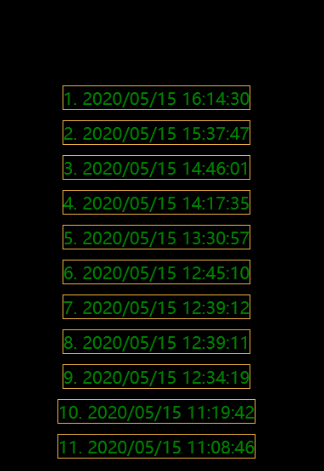

# 版本3

## 特点

- 支持 **css预编译器**。这里使用的是 `scss`，当然你也可以改成其他例如`less`等，只需要修改相应的loader就OK

- 全局 scss 变量

## 依赖
- `cnpm install css-loader sass-loader node-sass -D`
- `npm install mini-css-extract-plugin -D`

## 配置

### scss

只需要在`module.rules`添加一个规则，对`scss`文件引用对应loader进行处理即可

```js
{
test: /\.(wxss|sass|scss)$/i,
use: [
    {
        loader: minicssextractplugin.loader
    },
    'css-loader',
    {
        loader: 'sass-loader'
    }
]
}
```
`sass-loader` 用来把 `scss`语法转译成 `css`语法，`css-loader`用于把`css`文件当成一个js模块，可以`import` css文件
`mini-css-extract-plugin`用于把`js`文件引入的`css`模块单独抽离出一个`css`文件

然后在`plugins`字段中添加 `mini-css-extract-plugin`,指定生成的文件为`.wxss`文件

```js
new MiniCssExtractPlugin({
    filename: "[name].wxss",
    chunkFilename: "[id].wxss"
})
```

然后在页面的`ts`文件中改成 `import xxx.scss`的方式引入`scss`

```ts
//index.ts
import { hello, asyncHello, greet } from '@/lib/utils/hello'
import './index.scss' // 这里
//获取应用实例
const app = getApp()
// ... 省略八百字
```

### 全局 scss变量

在项目开发过程中，一些全局的样式变量，可以很方便的统一设置项目的通用样式，让项目的样式更加的一致。

现在`src/assets/styles/global.scss`中定义一些全局变量

```scss
$text-color-primary: #dcdcdc;
$text-color-disabled: #666;

$border-color-primary: #dcdcdc;
$border-color-warn: rgb(240, 178, 64);

$bg-color-primary: #fff;
$bg-color-black: #000;
```

通过 `sass-resources-loader`来全局注册变量。

先通过 `npm install sass-resources-loader -D` 来安装一下依赖，然后修改一下 webpack 配置，把上面的scss-loader 配置改一下

```diff
  module: {
    rules: [
      {
        test: /\.(js|ts)$/,
        use: ['babel-loader'],
        exclude: /\/node_modules\//
      },
      {
        test: /\.(sass|scss)$/i,
        use: [
          {
            loader: MiniCssExtractPlugin.loader
          },
          'css-loader',
          {
            loader: 'sass-loader'
          },
+          {
+            loader: 'sass-resources-loader',
+            options: {
+              resources: [
+                resolve(src, './assets/styles/global.scss') // 这里是你的全局变量文件位置
+              ]
+            }
+          }
+        ]
+      }
    ]
  },
```

然后尝试一下

```scss
// logs.scss
$border: 1px solid $border-color-warn;

.log {
  &-list {
    display: flex;
    flex-direction: column;
    padding: 40rpx;
    color: green;
    background-color: $bg-color-black; 
  }

  &-item {
    margin: 10rpx;
    border: $border;
  }
}
```

然后编译查看，done！




## 更新 dart-sass 代替 node-sass

之前使用的是`node-sass`，emmmm这个东西用`npm`安装的话经常会报错，具体原因的话可以自行百度。
然后找到解决方案是采用 `dart-sass`来代替 `node-sass`，OK说干就干。

`npm uninstall node-sass` 卸载`node-sass`

`npm install sass -D` 安装 `dart-sass`

然后把`sass-loader`配置改一点点，如下：

```diff
    {
      loader: 'sass-loader',
+      options: {
+        implementation: require('sass')
+      }
    },
```

然后重新编译就OK啦，妈妈再也不用担心我安装`node-sass`时候报错了！